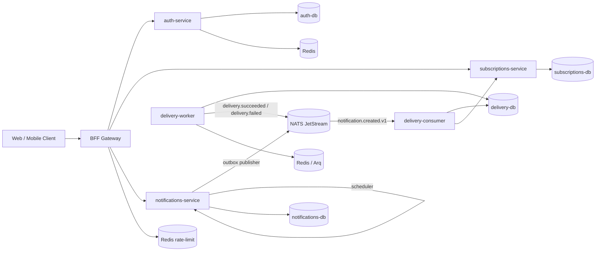

# Substy

Production-ready event-driven backend platform for subscriptions and notifications.

`Substy` is a microservice monorepo with asynchronous Python services, reliable event delivery through JetStream, Outbox pattern, retries/backoff, quiet hours support, and a single BFF entry point for clients.

## Why This Project

- Clean microservice boundaries with separate databases.
- Reliable messaging with at-least-once semantics.
- Strong delivery pipeline: fan-out, retries, DLQ-like dead attempts.
- Security-first auth flow and gateway controls.
- Production-oriented observability: metrics, traces, structured logs.

## Architecture



## Monorepo Structure

```text
substy/
  infra/                      # shared infra for auth + base stack
  services/
    auth/
    subscriptions/
    notifications/
    delivery/
    bff/
  libs/
    common/
  scripts/
    smoke_all.sh
    smoke_bff.sh
  Makefile
```

## Services

### `bff-gateway`
- Single public entrypoint.
- JWT validation and identity propagation.
- Rate limiting and safe proxying.
- Port: `8070`

### `auth-service`
- Register, login, refresh, logout, me.
- Access/refresh tokens.
- Secure session handling.
- Port: `8080`

### `subscriptions-service`
- Topics and user subscriptions.
- Subscription preferences:
  - channels
  - quiet hours
  - timezone
- Internal subscribers endpoint for delivery.
- Port: `8090`

### `notifications-service`
- Create notifications (immediate and scheduled).
- Outbox pattern for reliable publish.
- Scheduler process for due notifications.
- Port: `8091`

### `delivery-service`
- Consumes `notification.created.v1`.
- Fan-out by subscriber channels.
- Quiet-hours aware scheduling.
- Retry/backoff, dead attempts.
- API port: `8092`

## Tech Stack

- Python 3.12+
- FastAPI
- Pydantic v2
- asyncpg
- PostgreSQL
- Redis
- NATS + JetStream
- Arq
- OpenTelemetry
- pytest + pytest-asyncio
- Docker / Docker Compose

## Event Contracts

### Inbound
- `notification.created.v1`

### Outbound
- `delivery.succeeded.v1`
- `delivery.failed.v1`

Delivery processing is safe under at-least-once delivery with idempotency in DB constraints and processed event tracking.

## Quick Start

### Prerequisites
- Docker + Docker Compose
- Python virtualenv (optional for local pytest)

### 1) Start all services

```bash
cd /Users/user/coding/Substy/substy
make up
```

### 2) Check status

```bash
make ps
```

### 3) Run end-to-end smoke

```bash
make smoke
```

### 4) Tail logs

```bash
make logs
```

### 5) Stop all

```bash
make down
```

## Local Ports

| Service | URL | Health |
|---|---|---|
| BFF | `http://localhost:8070` | `/health` |
| Auth | `http://localhost:8080` | `/health` |
| Subscriptions | `http://localhost:8090` | `/health` |
| Notifications | `http://localhost:8091` | `/health` |
| Delivery API | `http://localhost:8092` | `/health` |

Infra ports (local development):
- Postgres: `5433`, `5434`, `5435`, `5436`
- Redis: `63790`, `63791`, `63792`
- NATS: `4223`, `4224`, `4225`

## Testing

### Monorepo unit tests

```bash
cd /Users/user/coding/Substy/substy
make test
```

### Service-level tests

Example:

```bash
cd /Users/user/coding/Substy/substy/services/delivery
source /Users/user/coding/Substy/.venv/bin/activate
python -m pytest -q delivery_service/tests/unit
python -m pytest -q delivery_service/tests/integration
```

## Smoke Scenarios

### Full system smoke

```bash
cd /Users/user/coding/Substy/substy
./scripts/smoke_all.sh
```

### BFF-only smoke (auth + refresh + protected + topics)

```bash
cd /Users/user/coding/Substy/substy
./scripts/smoke_bff.sh
```

## Security Notes

- Only BFF should be public.
- Internal services should run in private network.
- Do not log secrets/tokens.
- Keep JWT config synchronized between Auth and BFF.
- Use managed DB/Redis/NATS and HTTPS in production.

## Production Direction

Recommended deployment path:
1. Single-node Docker Compose for beta testing.
2. Kubernetes with separate deployments per process.
3. Managed Postgres/Redis, persistent JetStream, CI/CD and alerts.

## Frontend Integration

Frontend can live in a separate GitHub repository.
Use BFF (`:8070`) as the only backend entrypoint.

Recommended initial contract:
- `POST /api/auth/register`
- `POST /api/auth/login`
- `POST /api/auth/refresh`
- `POST /api/auth/logout`
- `GET /api/me`
- `GET /api/topics?cursor&limit`

Auth behavior in BFF:
- `login`/`refresh` return `access_token` and set `refresh_token` as `HttpOnly` cookie.
- `refresh_token` is not returned in JSON body from BFF.
- cookie defaults are local-dev friendly: `SameSite=Lax`, `Secure=false`, `domain=localhost` (implicit when domain is unset).

## Status

- `auth-service`: implemented
- `subscriptions-service`: implemented (with preferences)
- `notifications-service`: implemented (outbox + scheduler)
- `delivery-service`: implemented (channels + quiet hours + retry)
- `bff-gateway`: implemented
- monorepo orchestration: implemented (`make up`, `make smoke`)
