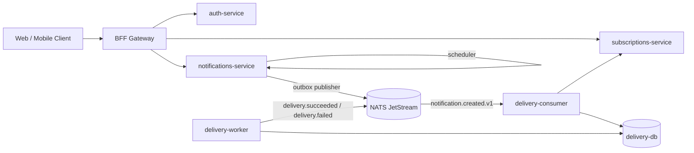

# Substy

Notification and Subscriptions Platform with a microservice backend, BFF gateway, and separate frontend.

## Recent Changes (March 2026)

- Added production-style local stack: `docker-compose.dev.yml`.
- Added CI stack: `docker-compose.ci.yml`.
- Added GitHub Actions integration workflow with Playwright e2e.
- Added robust CI diagnostics for compose startup failures.
- Added BFF-generated system notifications for:
  - subscribe: `subscription.subscribed`
  - unsubscribe: `subscription.unsubscribed`
- Exposed notification `payload` in notifications API responses.
- Updated frontend inbox contract to render readable subscription events from payload.
- Clarified auth refresh behavior for frontend reloads.
- Hardened DB DSN creation against special characters in DB credentials.

## Architecture



## Repository Layout

```text
substy/
  .github/workflows/ci.yml
  docker-compose.dev.yml
  docker-compose.ci.yml
  .env.example
  services/
    auth/
    subscriptions/
    notifications/
    delivery/
    bff/
  scripts/
```

## Services And Ports

| Service | Port | Health |
|---|---:|---|
| Frontend | 3000 | `/login` |
| BFF Gateway | 8070 | `/health` |
| Auth Service | 8080 | `/health` |
| Subscriptions Service | 8090 | `/health` |
| Notifications API | 8091 | `/health` |
| Delivery API | 8092 | `/health` |
| Postgres | 5432 (container-internal) | `pg_isready` |
| Redis | 6379 (container-internal) | `redis-cli ping` |
| NATS + JetStream | 4222 / 8222 | `/healthz` |

## Configuration

1. Copy env template:

```bash
cp .env.example .env
```

2. Ensure `FRONTEND_DIR` points to frontend source path.
   - Default: `../substy_web/notification-platform-frontend`

3. Keep frontend and backend browser host consistent (`localhost` or `127.0.0.1`, not mixed).

## Local Development: Full Stack

Start:

```bash
docker compose -f docker-compose.dev.yml --env-file .env up -d --build
```

Check:

```bash
curl http://localhost:8070/health
curl http://localhost:8080/health
curl http://localhost:8090/health
curl http://localhost:8091/health
curl http://localhost:8092/health
```

Logs:

```bash
docker compose -f docker-compose.dev.yml --env-file .env logs -f
```

Stop:

```bash
docker compose -f docker-compose.dev.yml --env-file .env down -v --remove-orphans
```

## Manual End-to-End Check Via UI

1. Open `http://localhost:3000`.
2. Register user and login.
3. Go to Topics and subscribe/unsubscribe to a topic.
4. Open Inbox.
5. Expected for new records:
   - title: `Subscribed` / `Unsubscribed`
   - message from payload: `You subscribed to topic updates.` / `You unsubscribed from topic updates.`

If you still see generic `Notification created`, check `/api/notifications/me` response.
If `payload.message` exists there, frontend is stale and needs rebuild/restart.

## Auth Session Behavior (Expected)

- After browser refresh, first `GET /api/me` may return `401`.
- Frontend then calls `POST /api/auth/refresh` with `refresh_token` cookie.
- Next `GET /api/me` should return `200`.

This is expected behavior, not a bug, as long as refresh succeeds.

## Subscription Event Notifications

Current flow:

1. Frontend calls BFF subscriptions endpoints.
2. BFF proxies subscribe/unsubscribe to subscriptions service.
3. On success, BFF creates a notification in notifications service with event payload.

Note: this flow is BFF-orchestrated. It is not yet a direct domain event emitted by subscriptions service.

## Delivery Channels And Email

- Channel preferences (`push`, `email`, `web`) are stored and used in fanout.
- Delivery service currently uses stub providers for all channels, including email.
- Result: selecting `email` creates and processes delivery attempts, but does not send real emails to SMTP/mailbox.

To enable real email delivery, implement and wire a real email provider (SMTP/API) in `delivery_service/providers`.

## CI/CD

Workflow: `.github/workflows/ci.yml`

Pipeline steps:

- checkout backend
- checkout frontend (local path or external repo)
- validate required secrets
- generate `.env.ci`
- start `docker-compose.ci.yml`
- wait for BFF health
- run Playwright e2e
- upload playwright report artifact
- stop stack

Required GitHub secrets:

- `POSTGRES_PASSWORD`
- `JWT_SECRET`
- `REFRESH_TOKEN_PEPPER`

Optional GitHub variable/secret when frontend is in another repository:

- `FRONTEND_REPOSITORY` (format: `owner/repo`)
- `FRONTEND_REPOSITORY_TOKEN` (for private repo access)

## Troubleshooting

### Ports 8070/8080/8090/8091 unavailable

Backend stack is not running. Start Docker daemon first, then run compose up.

### Frontend on 3000 is up, but login/register fail

Usually only frontend is running while backend is down. Verify BFF health on `:8070`.

### `401` on `/api/me`

Check if refresh request follows and succeeds. One initial `401` may be expected after reload.

### `401`/`422` on `/api/auth/refresh`

Clear site data/cookies for local host and re-login. Do not mix `localhost` and `127.0.0.1`.

### Port 3000 already in use

```bash
lsof -nP -iTCP:3000 -sTCP:LISTEN
kill -9 <PID>
```

## Legacy Make Targets

`Makefile` targets still exist for service-specific compose orchestration, but the recommended path is `docker-compose.dev.yml` and `docker-compose.ci.yml`.
